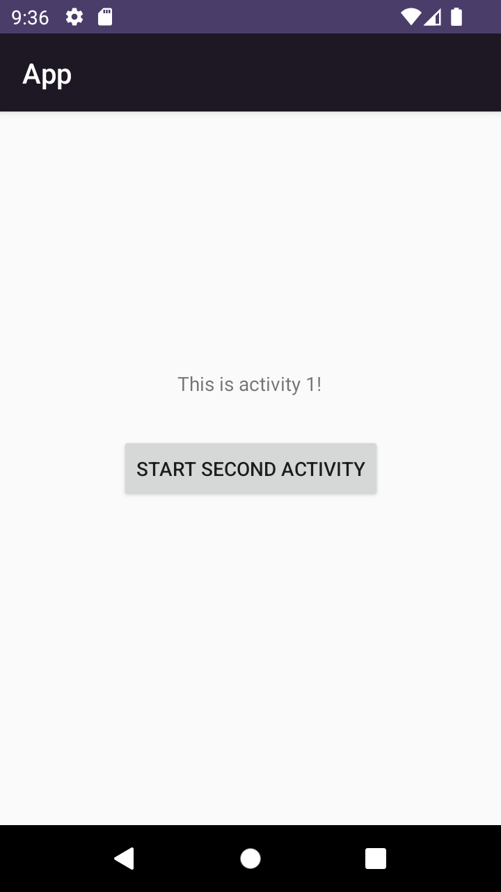

# Rapport

**Skriv din rapport här!**

**Först lade jag till en ny sida(activity).
Sedan lade jag till en knapp på både activity 1 och activity 2 i form av 
bland annat denna kod:**
```
@Override
    protected void onCreate(Bundle savedInstanceState) {
        super.onCreate(savedInstanceState);
        setContentView(R.layout.activity_main);

        Button button = findViewById(R.id.start_second_activity);
        button.setOnClickListener(new View.OnClickListener(){
            @Override
            public void onClick(View view) {
                Intent intent = new Intent(MainActivity.this, SecondActivity.class);
                intent.putExtra("name", "This is activity 2!");
                startActivity(intent);
            }
        });
    }
```
**Som vi ser i koden ovan har jag lagt in data i "intent", detta får textViewn
"This is activity 2!" att synas på sidan, det var den layout jag valde att lägga in
med tanke på att mist en widget var ett krav.
Jag ändrade även appens primärfärg till mörk-lila.**





Läs gärna:

- Boulos, M.N.K., Warren, J., Gong, J. & Yue, P. (2010) Web GIS in practice VIII: HTML5 and the canvas element for interactive online mapping. International journal of health geographics 9, 14. Shin, Y. &
- Wunsche, B.C. (2013) A smartphone-based golf simulation exercise game for supporting arthritis patients. 2013 28th International Conference of Image and Vision Computing New Zealand (IVCNZ), IEEE, pp. 459–464.
- Wohlin, C., Runeson, P., Höst, M., Ohlsson, M.C., Regnell, B., Wesslén, A. (2012) Experimentation in Software Engineering, Berlin, Heidelberg: Springer Berlin Heidelberg.
